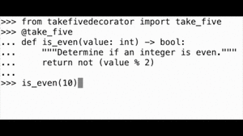

# Silly Decorator #3: `@take_five`

S6 E16 "Drought Conditions": A heated argument between Josh and Toby comes to blows. Later, at a party fundraiser, the president is told that to avoid the appearance of taking sides in a primary battle, the only person he's allowed to talk to is that Republican dude that Donna dated for a few episodes in season 3.



```python console
>>> import timeit
>>> from takefivedecorator import take_five
>>> def bad_sqrt(value: float, tolerance: float = 0.001) -> float:
...     """Compute sqrt(value) using the inefficient divide-and-conquer method."""
...     denominator_power: int = 1
...     numerator: int = 1
...     guess = value * numerator / (2**denominator_power)
...     while abs(guess**2 - value) > tolerance and denominator_power < 40:
...         denominator_power += 1
...         if guess**2 < value:
...             numerator = 2 * numerator + 1
...         else:
...             numerator = 2 * numerator - 1
...         guess = value * numerator / (2**denominator_power)
...     return guess
...
>>> bad_sqrt(2005)
44.77722402662039
>>> print(timeit.timeit("bad_sqrt(2005)", globals=globals(), number=10))
0.00011150000500492752
>>> @take_five
... def jazzy_sqrt(value: float, tolerance: float = 0.001) -> float:
...     """Like ``bad_sqrt``, but with more jazz!"""
...     return bad_sqrt(value, tolerance)
>>> jazzy_sqrt(2005)
🎵🎵🥁🥁🎷🎸🎷🎼🥁🎸🥁🎶🎷
44.77722402662039
>>> print(timeit.timeit("jazzy_sqrt(2005)", globals=globals(), number=10))
🎹🎹🎸🎷🎸🎸🎹🥁🎷🎷🥁🎶🎶
🎷🎸🎶🥁🎶🎼🎶🎶🎼🎸🎶🥁🎷
🎶🥁🎼🎼🎼🎹🎼🎵🎵🎵🎸🎼🎸
🎶🥁🎸🥁🎶🎼🎹🎷🎹🎷🎶🎸🎸
🎶🥁🎶🥁🎸🎹🎷🎵🥁🥁🎸🎶🎷
🎶🎵🎵🎷🎷🎵🎵🎸🎵🎸🥁🎷🎷
🎷🎸🥁🎷🎷🎼🎹🎹🎶🎵🎶🎶🎷
🎹🎸🥁🎸🎹🎷🎼🎷🎶🥁🎸🎹🥁
🎵🎶🎶🎹🎷🎶🎶🎵🎸🎹🎶🎼🎶
🥁🎹🎸🎼🎶🎹🎵🎸🎶🎸🎸🥁🎶
50.00062912501744
>>>
```

["Take Five"](https://www.youtube.com/watch?v=ryA6eHZNnXY)
